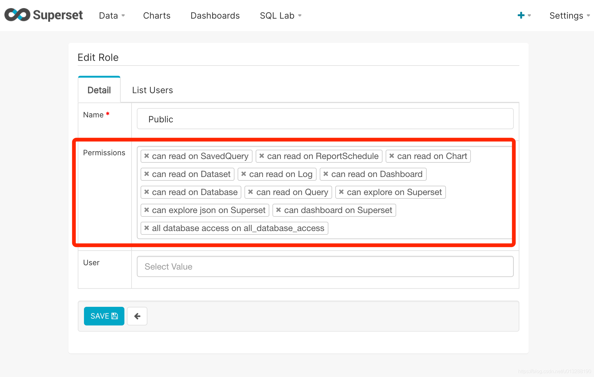

## 安装nginx
https://www.w3cschool.cn/docker/docker-install-nginx.html

## 安装superset
> amancevice/superset

https://blog.csdn.net/u014589856/article/details/103582824

> apache/superset

https://hub.docker.com/r/apache/superset

## apache/superset 汉化和允许iframe嵌套无登录访问
> apache/superset设置访问不需要登陆,搜索并修改appe/config.py

https://blog.csdn.net/u013288190/article/details/114843641

> 第一步：（我的办法）
安装好
https://hub.docker.com/r/apache/superset

```
$ docker run -d -p 8080:8088 --name superset apache/superset
```

> 第二步 修改配置文件汉化和无登录iframe访问

```
文件所在位置 配置文件：/app/superset/config.py 语言文件 /app/superset/transitions/zh/LC_MESSAGES

（1）进入容器
$ docker exec -it --user root superset /bin/bash

（2）修改config.py
安装vim
$ apt-get install vim 失败先更新apt-get update

$ vim /app/superset/config.py

修改以下内容：
WTF_CSRF_ENABLED=False
PUBLIC_ROLE_LIKE="Gamma"
BABEL_DEFAULT_LOCALE = 'zh'
HTTP_HEADERS={}

（3）在LC_MESSAGES添加message.mo
服务器上传文件
$ rz messages.mo
复制文件到superset
$ docker cp messages.mo superset:/app/superset/translations/zh/LC_MESSAGES/

```

> 第三步 初始化配置账号

```
$ docker exec -it superset superset fab create-admin
```

> 第四步 加载数据库

```
$ docker exec -it superset superset db upgrade
```

> 第五步 加载示例

```
$ docker exec -it superset superset load_examples
```

> 第六步 初始化权限

```
$ docker exec -it superset superset init
```

[message.mo](./messages.mo)

<a href="./messages.mo" target="_blank">messages.mo</a>

> mysql8.0以后版本需要 pip install mysql-connector-python

```
连接mysql mysql+mysqlconnector://root:XXXXXXXXXX@ip:端口/数据库?charset=utf8
```



## amancevice/superset 汉化和允许iframe嵌套无登录访问

> 1.拉起镜像

```
docker pull amancevice/superset
```
> 2.安装

```
创建挂载目录
>  mkdir -p /opt/docker/superset/conf & mkdir -p /opt/docker/superset/data

#启动
>  docker run --name superset -u 0 -d -p 8088:8088 -v /opt/docker/superset/conf:/etc/superset -v /opt/docker/superset/data:/var/lib/superset amancevice/superset
```

> 3.用户初始化

```
docker exec -it superset superset-init
录入账号后此时可以登陆了
```
> 4.汉化允许iframe嵌套无登录访问

```
进入容器
docker exec -it --user root 5dd1c0bc2d60 /bin/bash

找到配置文件
find ./ -type f -name config.py
在这里 /usr/local/lib/python3.6/site-packages/superset/config.py

安装vim
apt-get install vim 失败先更新apt-get update

> vim /usr/local/lib/python3.6/site-packages/superset/config.py

修改以下内容：
WTF_CSRF_ENABLED=False
PUBLIC_ROLE_LIKE="Gamma"
BABEL_DEFAULT_LOCALE = 'zh'
HTTP_HEADERS={}

修改完编译/site-packages/superset/translations (这下面就是语言文件，没有文件可以去github下载)
pybabel compile -d translations

修改完重启容器生效
docker stop superset
docker start superset
没生效清浏览器缓存
按下图配置权限
```


> 4最后也可以下载我配好的镜像heifahaizei/superset

```
docker pull heifahaizei/superset
```

## 更新superst
```
# Pull desired version
docker pull amancevice/superset

# Remove the current container
docker rm -f superset-old

# Deploy a new container ...
docker run --detach --name superset-new [options] amancevice/superset

# Upgrade the DB
docker exec superset-new superset db upgrade

# Sync the base permissions
docker exec superset-new superset init
```