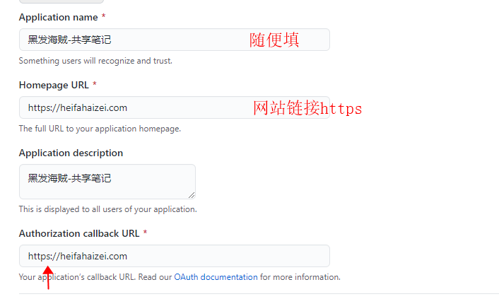

## 文档
https://github.com/gitalk/gitalk/blob/master/readme-cn.md

### 1:配置OAuth application


### 2:新建评论仓库初始化仓库和创建一条issue


### 2:安装插件gitalk
```
$ gitbook install

"plugins": [
    "mygitalk"
]
```

### 3:配置gitalk

```
"mygitalk": {
    "clientID": "ff8156cf39addd7559f4",
    "clientSecret": "******24ec90a30",
    "repo": "notes-comments",
    "owner": "YangJianFei",
    "admin": [
        "YangJianFei"
    ],
    "distractionFreeMode": false
}
```