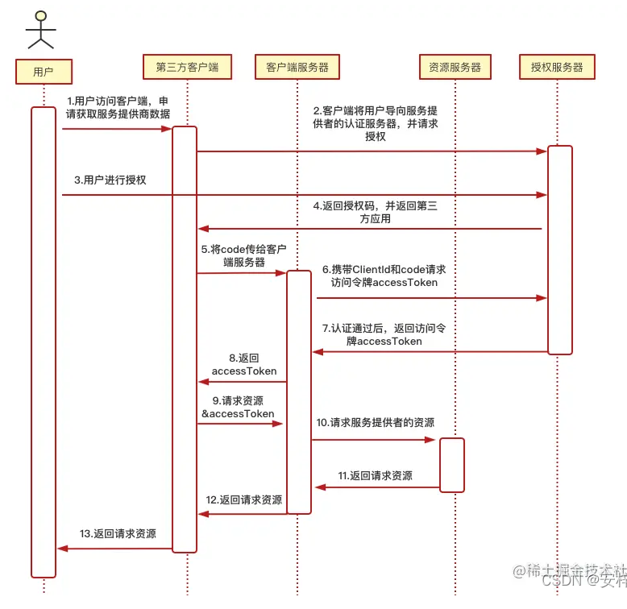
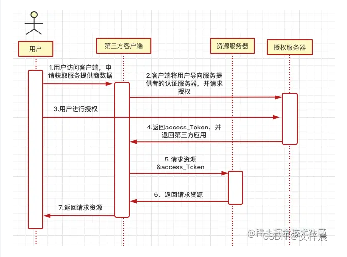

## oAuth2.0认证

## 微信三方登录
1：第三方发起微信授权登录请求，微信用户允许授权第三方应用后，微信会拉起应用或重定向到第三方网站，并且带上授权临时票据code参数；
2：通过code参数加上AppID和AppSecret等，通过API换取access_token；
3：通过access_token进行接口调用，获取用户基本数据资源或帮助用户实现基本操作。
每个用户在资源服务器中都有一个唯一的ID，第三方应用可以将其存储起来并与本地用户系统一一对应起来；

### 刷新access_token
access_token 是调用授权关系接口的调用凭证，由于 access_token 有效期（目前为 2 个小时）较短，当 access_token 超时后，可以使用 refresh_token 进行刷新，access_token 刷新结果有两种：
若access_token已超时，那么进行refresh_token会获取一个新的access_token，新的超时时间
若access_token未超时，那么进行refresh_token不会改变access_token，但超时时间会刷新，相当于续期access_token
