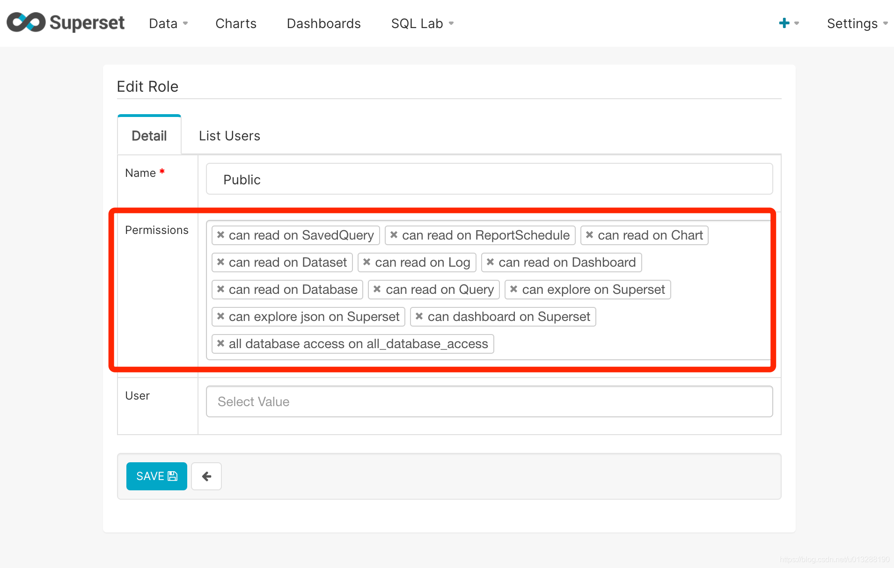

## 安装nginx
https://www.w3cschool.cn/docker/docker-install-nginx.html

## 安装superset
> amancevice/superset

https://blog.csdn.net/u014589856/article/details/103582824

> apache/superset

https://hub.docker.com/r/apache/superset

> apache/superset设置访问不需要登陆,搜索并修改appe/config.py

https://blog.csdn.net/u013288190/article/details/114843641

## amancevice/superset 汉化和允许iframe嵌套无登录访问

> 1.拉起镜像

```
docker pull amancevice/superset
```
> 2.安装

```
创建挂载目录
>  mkdir -p /opt/docker/superset/conf & mkdir -p /opt/docker/superset/data

#启动
>  docker run --name superset -u 0 -d -p 8088:8088 -v /opt/docker/superset/conf:/etc/superset -v /opt/docker/superset/data:/var/lib/superset amancevice/superset
```

> 3.用户初始化

```
docker exec -it superset superset-init
录入账号后此时可以登陆了
```
> 4.汉化允许iframe嵌套无登录访问

```
进入容器
docker exec -it --user root 5dd1c0bc2d60 /bin/bash

找到配置文件
find ./ -type f -name config.py
在这里 /usr/local/lib/python3.6/site-packages/superset/config.py

安装vim
apt-get install vim 失败先更新apt-get update

> vim /usr/local/lib/python3.6/site-packages/superset/config.py

修改以下内容：
WTF_CSRF_ENABLED=False
BABEL_DEFAULT_LOCALE = 'zh'
PUBLIC_ROLE_LIKE="Gamma"
HTTP_HEADERS={}

修改完编译/site-packages/superset/translations (这下面就是语言文件，没有文件可以去github下载)
pybabel compile -d translations

修改完重启容器生效
docker stop superset
docker start superset
按下图配置权限
```
